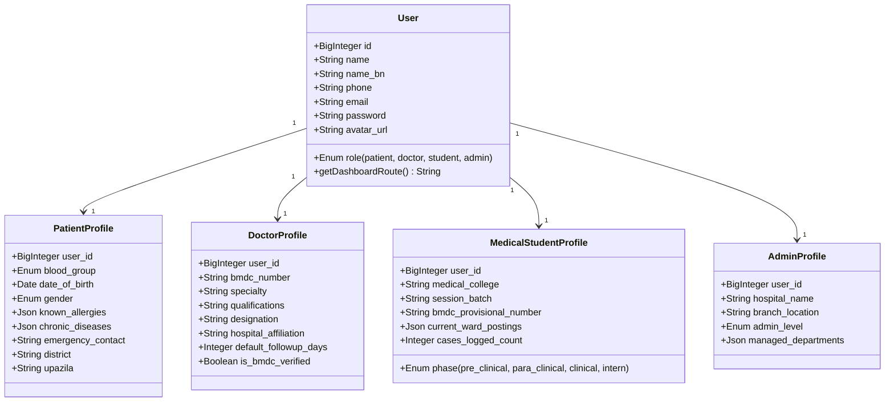
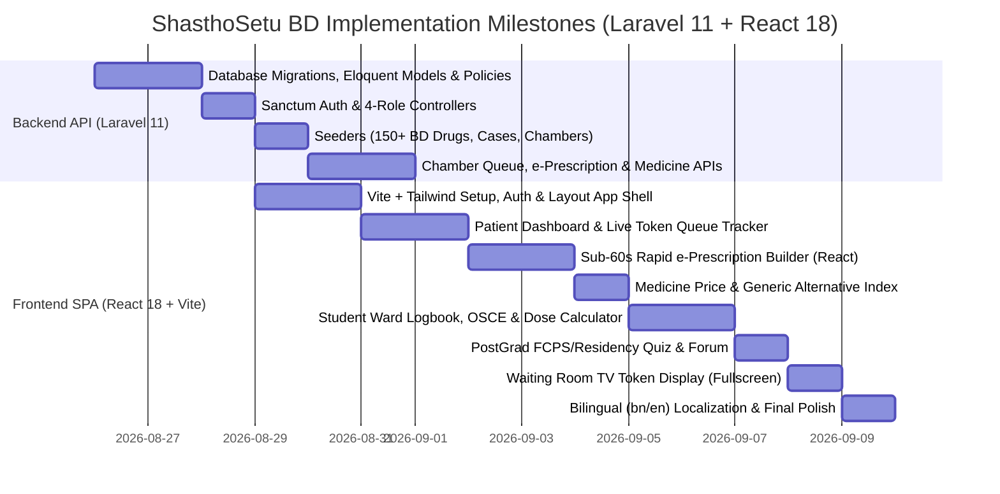

# ShasthoSetu BD (স্বাস্থ্যসেতু বিডি) — OpenHealthBD
### Comprehensive Healthcare & Medical Education Platform Architecture Plan
**Technology Stack:** Laravel 11 (REST API / Sanctum / Broadcasting) + React 18 (Vite / TypeScript / Tailwind CSS)

> A dedicated, production-grade digital health and medical education ecosystem built from the ground up for Bangladesh's healthcare realities.

---

## 1. Executive Summary & Vision

**ShasthoSetu BD (OpenHealthBD)** is a unified healthcare and medical education platform specifically architected to resolve chronic pain points across the Bangladeshi medical ecosystem:
1. **For Patients (রোগী):** Eliminating the grueling 3–5 hour waiting room chaos via **Live Serial/Token Tracking**, providing **legible bilingual e-Prescriptions**, demystifying healthcare costs via a **Medicine Price & Generic Alternative Index**, offering a **14-day free report follow-up tracker**, and providing instant access to **Verified Blood Donors & Emergency ICU/Bed Directory**.
2. **For Doctors (চিকিৎসক):** Enabling rapid **sub-60-second structured e-prescriptions** with Bangladesh-native brand presets and Bengali advice chips, **multi-chamber practice scheduling** (Govt Hospital morning + Private Chamber evening), and **compounder/assistant queue management**.
3. **For Medical Students & Interns (মেডিকেল শিক্ষার্থী ও ইন্টার্ন চিকিৎসক):** Providing a **Clinical Ward Case Logbook & Bedside History Sheet Builder**, **OSCE/OSPE clinical examination checklists**, a **Pediatric mg/kg weight-based dose calculator**, **FCPS Part-1 & MD/MS Residency post-grad preparation banks**, and a peer **Clinical Case Discussion Forum** for ECG/X-Ray interpretation.
4. **For Hospital & Chamber Admins:** A dedicated **Waiting Room TV Token Display Board**, bed/ICU inventory counter, and doctor roster management.

---

## 2. Four Core Personas & Role-Based Access Control (RBAC)

The system is built on Laravel Sanctum + Policy-based authorization with four first-class roles:



---

## 3. Real Problems Solved & Feature Specifications

### 3.1. Bangladeshi Patients (রোগীদের বাস্তব সমস্যা ও সমাধান)

| Problem in Bangladesh | OpenHealthBD Solution | Laravel & React Implementation |
|---|---|---|
| **"সিরিয়াল দেওয়ার যন্ত্রণা"** — Waiting 3–5 hours blindly in crowded clinic corridors without knowing when the doctor will arrive or call their number. | **Live Chamber Serial/Token Tracker (লাইভ সিরিয়াল মনিটর)** | Real-time queue tracker showing `Current Serial Calling`, `Your Token`, `Estimated Time`, and `Doctor State` (*In Chamber*, *On the Way*, *In Emergency*, *Break*). Live WebSockets (Laravel Reverb / Pusher) or SSE with React hook `useLiveQueue`. |
| **Illegible Handwritten Prescriptions** — Misread dosages causing wrong medication, toxic interactions, or patient anxiety. | **Structured Bilingual e-Prescription** | Digital prescriptions formatted with clear dosage icons (`১+০+১`), exact timing (`খাবার ৩০ মিনিট আগে/পরে`), duration, advised tests, and dietary advice. Exportable & printable standard A4 PDF via `@react-pdf/renderer` or printable React DOM. |
| **High Out-of-Pocket Medicine Costs & Confusion** — Patients cannot afford expensive brands or don't know generic equivalents. | **Medicine Price & Generic Alternative Index** | Search any BD brand (e.g. *Napa Extra, Seclo, Maxpro, Sergel, Monas, Bexitrol*), inspect official DGDA/MRP prices, generic formula, cheaper top-grade alternatives (Square, Incepta, Beximco, Renata), and pregnancy safety category. Fast Laravel Eloquent / Meilisearch fuzzy querying. |
| **Losing the 14-Day Free Report Window** — In BD, doctors review lab reports free or at a discount within 7–14 days. Patients often miss this window. | **Report Review & Follow-up Tracker** | Auto-calculates remaining days for free report review based on doctor's consultation date and flags alert badges in the patient dashboard. |
| **Critical Blood Shortage & Fake Donors** — Frantic searches on social media during emergency surgery or thalassemia transfusions. | **Verified Blood Donor Network** | Filter by District, Upazila, and Blood Group (`A+`, `B+`, `O+`, `AB+`, `A-`, `B-`, `O-`, `AB-`). Enforces **90-day donation cooldown timer** before a donor shows as "Available". Click-to-call / SMS button. |
| **Scattered Paper Records in Polythene Bags** — Patients lose past prescriptions and test reports between doctor visits. | **Patient Health Vault & Timeline** | Centralized repository for chronic conditions (Diabetes, HTN, CKD, Asthma), drug allergies (Penicillin, Sulfa, NSAIDs), past lab reports, and chronological prescription timeline. |
| **Emergency ICU / Bed Shortage** — Families driving from clinic to clinic desperately seeking an ICU or incubator. | **Hospital Bed & ICU Vacancy Directory** | Live counter of General beds, ICU, CCU, HDU, and NICU across registered government and private facilities with direct hotline dials. |

---

### 3.2. Bangladeshi Doctors (চিকিৎসকদের বাস্তব সমস্যা ও সমাধান)

| Problem in Bangladesh | OpenHealthBD Solution | Laravel & React Implementation |
|---|---|---|
| **Extreme Patient Volume (40–80 patients/session)** — Doctors cannot spend 5 minutes typing long medical texts per patient. | **Rapid Sub-60s Structured e-Prescription Writer** | Interactive React Prescription Builder with Chief Complaint chips, instant O/E vitals keypad (BP, Pulse, Temp, SpO2, Wt), pre-built investigation bundles (*Fever panel, Dengue NS1+CBC, Diabetic workup, Pre-op panel*), drug autocomplete with BD brand dosage presets, and 1-click Bengali advice chips. |
| **Multi-Location Practice** — Practicing morning at Government Medical (DMCH, BSMMU, SSMC) and evening at 1 or 2 private chambers. | **Multi-Chamber & Schedule Manager** | Doctors configure distinct chambers (e.g., *Chamber 1: Popular Dhanmondi [5PM-8PM, ৳1000]*, *Chamber 2: Ibn Sina Uttara [8:30PM-10PM, ৳1200]*), daily token quotas, and off-days. |
| **Compounder/Assistant Coordination Chaos** — Doctor cannot manage queue while treating patients. | **Assistant/Compounder Live Terminal** | Dedicated simplified receptionist view: check-in arriving patients, advance calling token, mark no-show/absent, handle report-only queue, and trigger live token updates via Laravel API. |
| **Quacks & Fake Doctor Menace** — Genuine doctors lose trust due to unqualified individuals practicing medicine. | **BMDC Verified Badge** | Doctors register their official BMDC Registration Number, verified degrees (MBBS, FCPS, MD, MS, MRCP, DGO), and current institutional rank. |
| **Longitudinal Patient History Access** | **One-Glance Patient Timeline** | Doctor can instantly view previous diagnoses, medications prescribed, and lab values for patients they have consulted with Laravel row-level policy enforcement. |

---

### 3.3. Medical Students & Intern Doctors (শিক্ষার্থী ও ইন্টার্ন চিকিৎসকদের বাস্তব সমস্যা ও সমাধান)

| Problem in Bangladesh | OpenHealthBD Solution | Laravel & React Implementation |
|---|---|---|
| **Bedside Ward Case Sheets on Paper** — MBBS clinical students (3rd, 4th, 5th year) struggle to maintain disorganized paper logbooks across Medicine, Surgery, Gynae, and Paediatrics wards. | **Digital Clinical Ward Logbook & Case Builder** | Standardized clinical history builder: *Chief Complaints with duration*, *HPI (7 dimensions)*, *Past Medical/Surgical history*, *General Physical Examination (Anemia, Jaundice, Cyanosis, Clubbing, Koilonychia, Edema, Lymph nodes, Thyroid, Pulse, BP)*, *Systemic Examination*, *Salient Features*, *Differential Diagnoses*, *Investigation Plan*, and *Treatment Plan*. Printable clinical case export. |
| **OSCE & OSPE Clinical Exam Fear** — High failure rate in final professional exams due to lack of structured station practice. | **OSCE / OSPE Station Checklist & Viva Guide** | Step-by-step clinical exam station guides with interactive timer and checklist (*CVS exam: inspection, palpation of apex beat/heave/thrill, auscultation with bell/diaphragm*; *Abdominal exam: palpation of liver/spleen/kidney, fluid thrill, shifting dullness*). OSPE instruments (Cheatle forceps, sponge holder, Proctoscope) and pathology specimen spotters with high-yield viva Q&As. |
| **Complex Pediatric Drug Dosing** — Interns and students fear toxicity when calculating weight-based doses during emergency night duties. | **Pediatric mg/kg Weight-Based Dose Calculator** | Instant React calculator for common pediatric drugs (Paracetamol 15mg/kg/dose, Amoxicillin 45mg/kg/day, Azithromycin 10mg/kg/day, Salbutamol, Ceftriaxone, Zinc, ORS rules) with volume/spoon conversions (drops vs syrup vs suspension). |
| **Confusing Post-Graduation Exam Pathways** — Final year students and interns lack structured roadmaps for **FCPS Part-1 (BCPS)** and **MD/MS Residency (BSMMU/DGHS)**. | **Post-Graduation Roadmap & Question Bank Hub** | Syllabus guides, subject breakdown (Anatomy, Physiology, Biochemistry, Pathology, Pharmacology, Microbiology, Medicine/Surgery/Gynae), and high-yield MCQs/SBA interactive practice tests with instant rationales. |
| **Challenging Case Discussions & ECG Learning** — Students lack quick feedback from senior registrars and professors on rare ward cases. | **Clinical Case Study Forum** | Anonymized case sharing with ECG strips, Chest X-Rays, CT scans, and clinical photographs for interactive diagnostic discussions, differential debate, and peer learning. |
| **Intern Roster & Duty Swapping** — Chaotic night duty scheduling and casualty rotations leading to burnout. | **Intern Duty Roster & Shift Swap Manager** | Interactive ward roster tracking emergency shifts, night duties, and shift-swap approvals between intern peers. |

---

### 3.4. Hospital / Chamber Admin & Receptionist (হাসপাতাল ও চেম্বার অ্যাডমিন)

| Feature | Description |
|---|---|
| **Waiting Room Live TV Display Mode** | Clean, high-contrast, fullscreen React view designed for waiting area TVs with current calling serial number per doctor/room, visual flashing, and browser audio chime alert. |
| **Bed & ICU Availability Manager** | Real-time management of General Beds, Male/Female Wards, Cabin, ICU, CCU, HDU, and NICU counts. |
| **Doctor & Chamber Onboarding** | Setup chamber rooms, visiting hours, slot limits, fee structure, and BMDC credential validation. |
| **Clinic Operational Analytics** | Chart.js / Recharts dashboards tracking daily patient footfall, department breakdown, peak load hours, and no-show rates. |

---

## 4. Full Technology Architecture: Laravel 11 + React 18

```
medical/
├── backend/                             # Laravel 11 REST API Backend
│   ├── app/
│   │   ├── Http/
│   │   │   ├── Controllers/Api/
│   │   │   │   ├── AuthController.php          # Login, Register, Profile, Role Switching
│   │   │   │   ├── PatientController.php       # Bookings, Medical Vault, History
│   │   │   │   ├── DoctorController.php        # Chambers, Queue, e-Prescription CRUD
│   │   │   │   ├── MedicalStudentController.php# Case Logbook, OSCE, PostGrad Quiz
│   │   │   │   ├── AdminController.php         # Hospital beds, Doctor onboarding
│   │   │   │   ├── ChamberQueueController.php  # Assistant counter & Live Token Broadcaster
│   │   │   │   ├── MedicineController.php      # DIMS-style drug search & pricing
│   │   │   │   ├── BloodBankController.php     # Donor search with 90-day cooldown
│   │   │   │   └── ClinicalForumController.php # Case studies & ECG/X-Ray discussions
│   │   │   ├── Requests/                       # Validation FormRequests
│   │   │   └── Resources/                      # JsonResources for clean API responses
│   │   ├── Models/
│   │   │   ├── User.php                        # Base user model
│   │   │   ├── PatientProfile.php
│   │   │   ├── DoctorProfile.php
│   │   │   ├── MedicalStudentProfile.php
│   │   │   ├── AdminProfile.php
│   │   │   ├── Chamber.php                     # Doctor's chamber & visiting slots
│   │   │   ├── Appointment.php                 # Bookings with serial tokens & status
│   │   │   ├── Prescription.php                # Structured e-Prescription
│   │   │   ├── PrescriptionItem.php            # Medicines with dose & timing
│   │   │   ├── DrugIndex.php                   # BD medicines, generics, MRP, company
│   │   │   ├── ClinicalCaseLog.php             # Medical student bedside case sheets
│   │   │   ├── OSCEStation.php                 # Clinical examination checklists
│   │   │   ├── PostGradQuestion.php            # FCPS-1 / Residency question bank
│   │   │   ├── ClinicalForumPost.php           # Discussion posts with image uploads
│   │   │   ├── ClinicalComment.php             # Comments on case posts
│   │   │   ├── BloodDonor.php                  # Donors with last donation date
│   │   │   └── BedAvailability.php             # ICU, CCU, General bed counts
│   │   ├── Policies/                           # Row-level patient medical record security
│   │   └── Events/                             # Live Queue Token Updated Events (Reverb/Pusher)
│   ├── database/
│   │   ├── migrations/                         # Complete schema definitions
│   │   └── seeders/                            # Rich Bangladesh medical demo seeders
│   │       ├── DatabaseSeeder.php
│   │       ├── UserSeeder.php                  # Demo accounts for all 4 roles
│   │       ├── HospitalChamberSeeder.php       # DMCH, BSMMU, Popular, Square
│   │       ├── DrugIndexSeeder.php             # Top 150 BD medicines (Square, Incepta, Beximco)
│   │       ├── ClinicalCaseSeeder.php          # Realistic ward cases for students
│   │       ├── OSCEStationSeeder.php           # Examination checklists
│   │       ├── PostGradQuizSeeder.php          # FCPS-1 & Residency high-yield MCQs
│   │       └── BloodDonorSeeder.php            # Donors across 64 districts & thanas
│   └── routes/
│       ├── api.php                             # REST API route definitions
│       └── channels.php                        # Broadcasting channel authorization
│
└── frontend/                            # React 18 + Vite + TypeScript Frontend
    ├── src/
    │   ├── api/                                # Axios client with interceptors
    │   │   ├── client.ts
    │   │   ├── authApi.ts
    │   │   ├── patientApi.ts
    │   │   ├── doctorApi.ts
    │   │   ├── studentApi.ts
    │   │   ├── medicineApi.ts
    │   │   └── queueApi.ts
    │   ├── components/
    │   │   ├── layout/                         # App Shell, Sidebar, Topbar, RoleSwitcher
    │   │   ├── common/                         # Button, Badge, Modal, FormInput, Alert
    │   │   ├── patient/                        # LiveTokenCard, PrescriptionView, GenericCompareCard
    │   │   ├── doctor/                         # RapidPrescriptionBuilder, QueueManagerTable
    │   │   ├── student/                        # CaseLogbookForm, OSCEChecklistViewer, DoseCalculator
    │   │   ├── queue/                          # WaitingRoomTVDisplay, AssistantCounterTerminal
    │   │   └── emergency/                      # BloodDonorFinder, BedVacancyBadge
    │   ├── context/                            # AuthContext, LanguageContext (en/bn), QueueContext
    │   ├── hooks/                              # useAuth, useLiveQueue, useLanguage, useDebounce
    │   ├── locales/                            # en.json, bn.json (Native Bengali translations)
    │   ├── pages/
    │   │   ├── auth/                           # Login, Register, DemoQuickLogin
    │   │   ├── patient/                        # PatientDashboard, BookAppointment, MyPrescriptions, HealthVault
    │   │   ├── doctor/                         # DoctorDashboard, ChamberQueue, WritePrescription, MyChambers
    │   │   ├── student/                        # StudentDashboard, CaseLogbook, OSCEHub, DoseCalc, PostGradQuiz, Forum
    │   │   ├── admin/                          # AdminDashboard, BedManager, DoctorRoster, ClinicAnalytics
    │   │   ├── queue/                          # PublicTokenDisplay (TV Fullscreen View)
    │   │   ├── medicine/                       # MedicinePriceIndex, GenericFinder
    │   │   └── emergency/                      # BloodBank, EmergencyBeds, AmbulanceDirectory
    │   ├── types/                              # TypeScript interfaces for all domain entities
    │   └── App.tsx
    ├── package.json
    ├── tailwind.config.js
    └── vite.config.ts
```

---

## 5. UI/UX Design System & Bangladesh Localization

### 5.1. Color Palette & Theming (Tailwind CSS Tokens)

```javascript
// tailwind.config.js
module.exports = {
  content: ['./index.html', './src/**/*.{js,ts,jsx,tsx}'],
  theme: {
    extend: {
      colors: {
        teal: {
          50: '#F0FDFA',
          100: '#CCFBF1',
          500: '#14B8A6',
          600: '#0D9488',
          700: '#0F766E', // Primary ShasthoSetu Teal
          800: '#115E59',
          900: '#134E4A',
        },
        navy: {
          800: '#1E293B',
          900: '#0F172A',
        },
        emergency: {
          500: '#EF4444',
          600: '#DC2626', // Critical red for Blood / ICU
        },
      },
      fontFamily: {
        sans: ['Inter', 'Noto Sans Bengali', 'sans-serif'],
        bangla: ['Noto Sans Bengali', 'SolaimanLipi', 'sans-serif'],
      },
    },
  },
  plugins: [],
}
```

### 5.2. Bilingual Localization (English & Bangla)
- Complete UI translation using React Context and locale dictionaries (`en.json`, `bn.json`).
- Prescription dosage chips render seamlessly in Bangla: `১+০+১`, `০+১+০`, `১+১+১`, `খাবার ৩০ মিনিট আগে/পরে`.
- English/Bangla numeral converter utility (`123` ⇄ `১২৩`).

---

## 6. Realistic Bangladesh Seed Data

The platform seeders in Laravel provide culturally accurate demo data:

### 6.1. Healthcare Institutions & Chambers
- **Dhaka Medical College Hospital (DMCH)** — Ward 1 (Medicine), Ward 7 (Surgery), NICU
- **Bangabandhu Sheikh Mujib Medical University (BSMMU / PG Hospital)** — Dept of Cardiology, Dept of Rheumatology
- **Popular Diagnostic Centre (Dhanmondi Branch)** — Evening Specialist Chambers
- **Square Hospital (Panthapath)** — Emergency & CCU
- **Ibn Sina Medical College & Hospital (Kalyanpur/Uttara)**
- **Chittagong Medical College Hospital (CMCH)**
- **Rajshahi Medical College Hospital (RMCH)**

### 6.2. Common Bangladeshi Medicine Brands in Drug Index
- **Paracetamol:** *Napa, Napa Extra, Fast, Ace, Ace Plus, Pyrex* (500mg, 665mg XR, Syrup, Drops, Suppository)
- **Proton Pump Inhibitors (PPI):** *Seclo, Maxpro, Sergel, Pantonix, Finix, Proceptin* (20mg, 40mg)
- **Antibiotics:** *Cef-3, Fixolin, Zithrox, Tridosil, Moxaclav, Ciprocin, Azithral*
- **Antihistamines / Respiratory:** *Fexo, Alatrol, Bilashin, Monas, Montene, Bexitrol Inhaler, Windel*
- **Cardiovascular & Antidiabetic:** *Cardipin, Angilock, Bislol, Concor, Comet (Metformin), Gluconor, Januvia*
- **Pediatric Drops / Suspensions:** *Tamen, Amodis, Filwel Gold, Adryl, Brofex*

### 6.3. Standard Medical Student Clinical Cases
- **Case 1 (Internal Medicine):** 28-year-old male with high-grade continuous fever with retro-orbital pain, myalgia, and positive Dengue NS1 antigen with thrombocytopenia.
- **Case 2 (General Surgery):** 22-year-old female presenting with acute periumbilical pain shifting to right iliac fossa, with tenderness at McBurney's point (Acute Appendicitis).
- **Case 3 (Paediatrics):** 14-month-old child presenting with acute watery diarrhea and some dehydration (IMCI classification and Plan B fluid management).
- **Case 4 (Gynae & Obs):** 26-year-old Primigravida at 34 weeks gestation with elevated blood pressure (150/100 mmHg) and proteinuria (Preeclampsia management).

---

## 7. Implementation Roadmap & Build Milestones (Laravel + React)



---

## 8. Summary of Advantages (Laravel 11 + React 18)

1. **Ultra-Fast & Modular Development:** Laravel 11's streamlined directory structure, robust Eloquent ORM, and Sanctum token auth make building secure medical REST APIs exceptionally fast.
2. **Dynamic, High-Speed Doctor UX in React:** React state management allows creating an interactive, keyboard-friendly prescription builder where doctors can select chips, dosages, and BD brand presets in seconds without page reloads.
3. **Real-Time Waiting Room Experience:** Live updates for patient queues and clinic TV display screens using Laravel Reverb / WebSockets / SSE.
4. **Single-Page Application (SPA) / PWA Ready:** Patients and medical students can use the platform smoothly on mobile devices right from hospital wards or clinic waiting areas.
